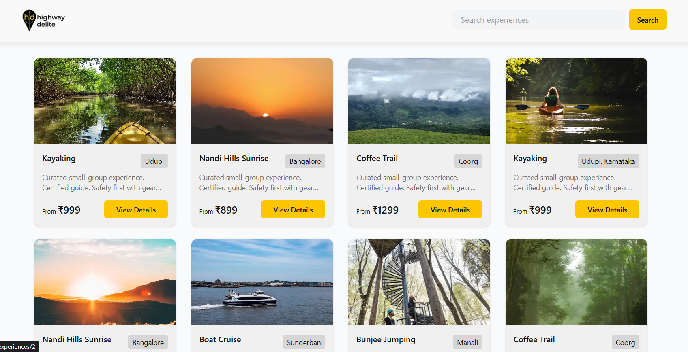
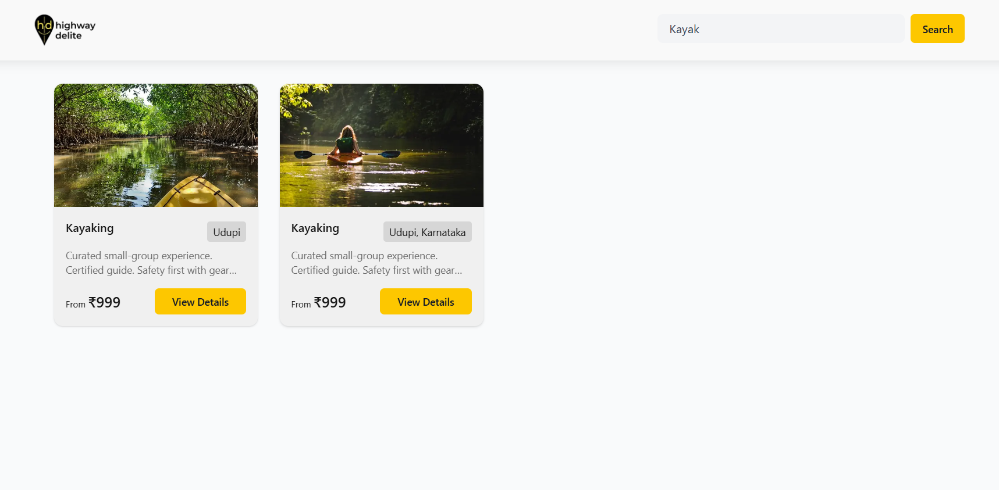
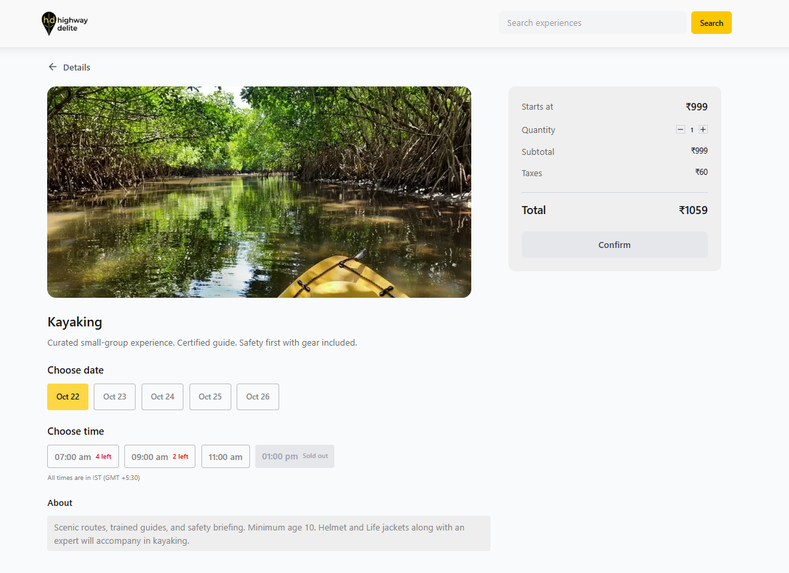
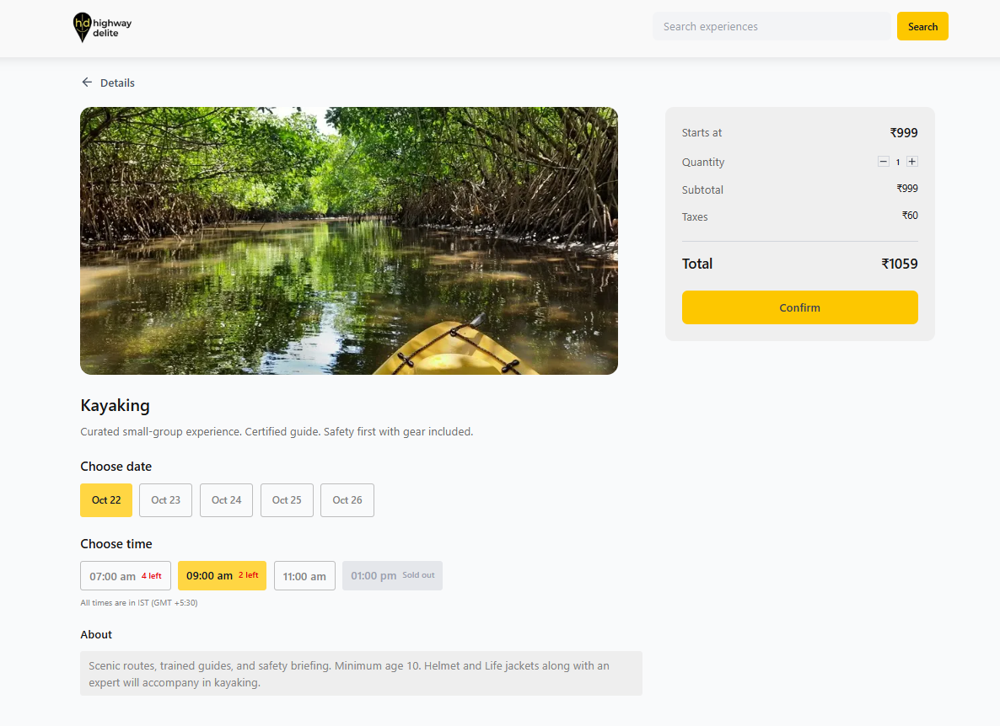
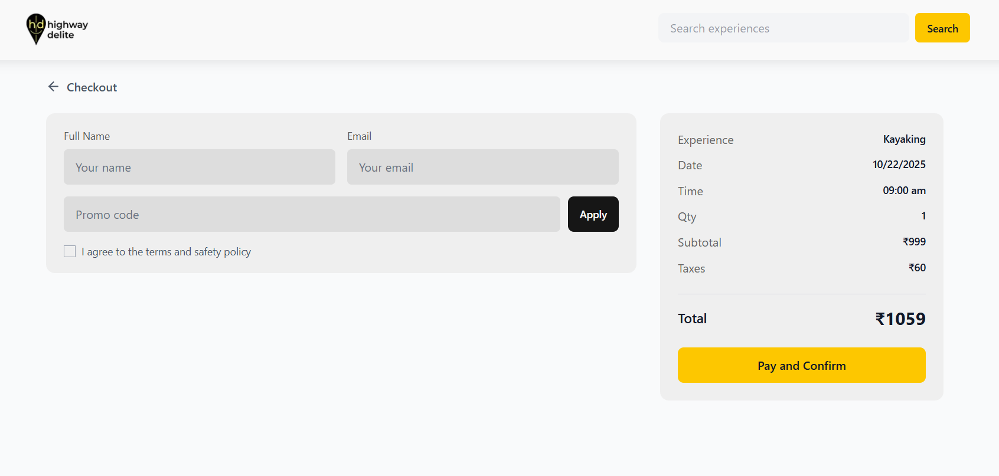
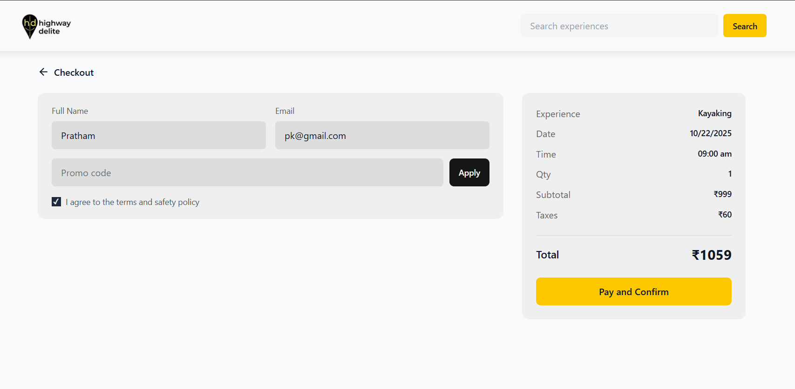
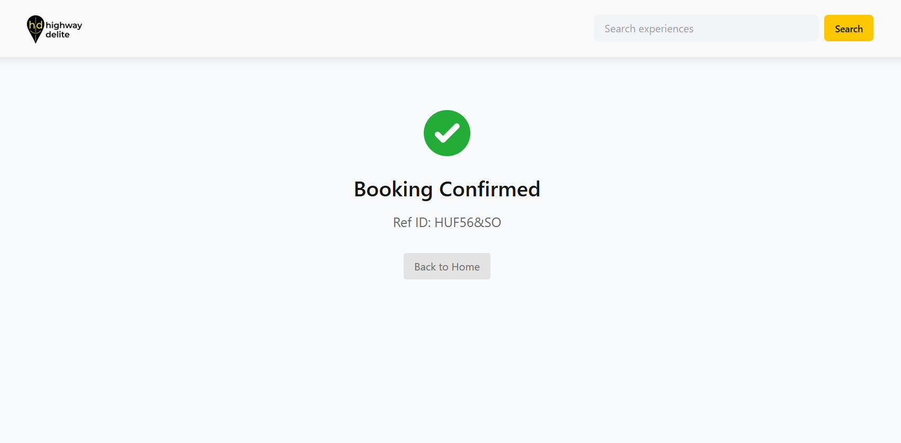

# BookIt: Experiences & Slots

A fullstack travel experience booking application built with Next.js, TypeScript, and TailwindCSS.

## Assignment Completion ✅

## Application Flow

### 1. Home Page - Browse Experiences



### 2. Experience Details - View Slots & Information



### 3. Checkout - Enter Details & Apply Promo



### 4. Confirmation - Booking Success



### Frontend Requirements
- ✅ **Framework:** React + TypeScript with Next.js
- ✅ **Styling:** TailwindCSS implemented throughout
- ✅ **Pages Built:**
  - Home Page: Lists all experiences fetched from backend API
  - Details Page: Shows experience details, dates, and available slots
  - Checkout Page: User info form, promo code validation, and price summary
  - Confirmation Page: Booking success/failure messages
- ✅ **UX/UI:** Responsive, mobile-friendly design with clean spacing
- ✅ **State Management:** React hooks for managing application state
- ✅ **Form Validation:** Email and name validation implemented
- ✅ **Design Fidelity:** Matches Figma design across all breakpoints

### Backend Requirements
- ✅ **Framework:** Next.js API Routes
- ✅ **API Endpoints:**
  - `GET /api/experiences` - Returns list of experiences
  - `GET /api/experiences/:id` - Returns experience details with slots
  - `POST /api/bookings` - Accepts and stores booking details
  - `POST /api/promo/validate` - Validates promo codes (SAVE10, FLAT100)
- ✅ **Data Handling:** Mock data structure with validation
- ✅ **Slot Management:** Prevents double-booking logic

### Integration Flow
- ✅ Complete user journey: Home → Details → Checkout → Confirmation
- ✅ Dynamic data fetching from backend APIs
- ✅ Loading states, error handling, and user feedback

## Tech Stack

**Frontend:** Next.js 15, TypeScript, TailwindCSS  
**Backend:** Next.js API Routes  
**State Management:** React Hooks

## Getting Started

```bash
# Install dependencies
npm install

# Run development server
npm run dev
```

Open [http://localhost:3000](http://localhost:3000) to view the application.


## API Endpoints

- `GET /api/experiences` - Fetch all experiences
- `GET /api/experiences/:id` - Get experience details
- `POST /api/bookings` - Create a booking
- `POST /api/promo/validate` - Validate promo codes

## Available Promo Codes

- `SAVE10` - 10% discount
- `FLAT100` - ₹100 flat discount

## Project Structure

```
app/
├── api/                    # Backend API routes
│   ├── bookings/          # Booking creation endpoint
│   ├── experiences/       # Experience listing & details
│   └── promo/validate/    # Promo code validation
├── components/            # Reusable React components
│   ├── ExperienceCard.tsx
│   ├── Header.tsx
│   └── PriceSummary.tsx
├── checkout/             # Checkout page
├── confirmation/         # Booking confirmation page
├── experiences/[id]/     # Dynamic experience details page
└── lib/                  # Utilities and types
    ├── api.ts           # API client functions
    ├── mockData.ts      # Experience data
    └── types.ts         # TypeScript interfaces
```

## Deliverables Completed

✅ Fully functional booking flow from browsing to confirmation  
✅ Responsive design with royalty-free images from Unsplash/Pexels  
✅ Clean code structure with TypeScript for type safety  
✅ Complete README with setup instructions  
✅ Ready for deployment on Vercel/Render/Railway
